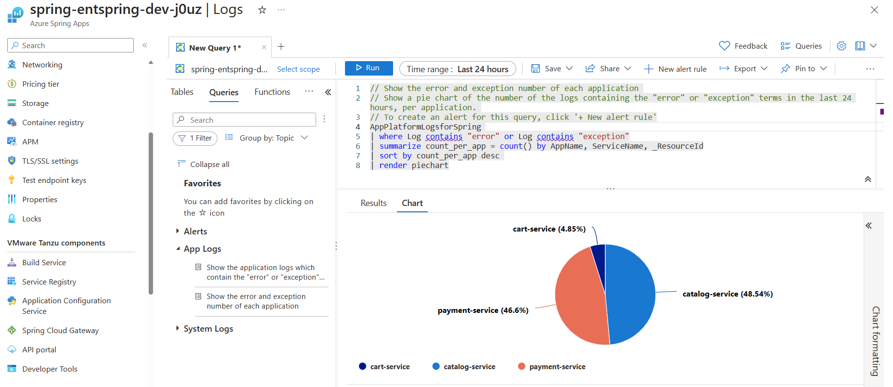
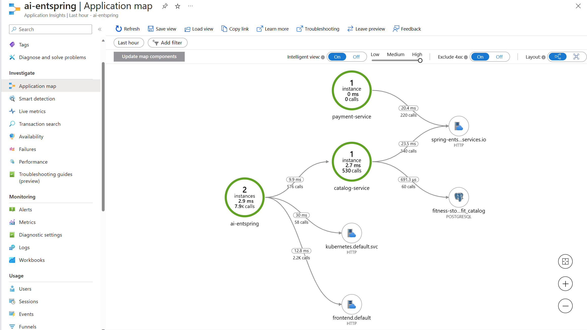
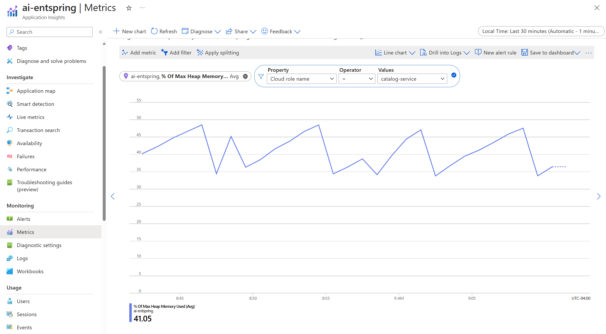
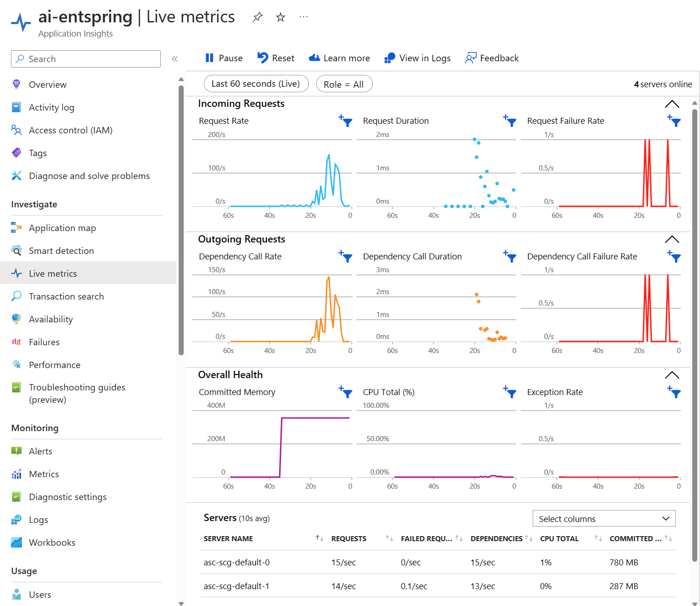
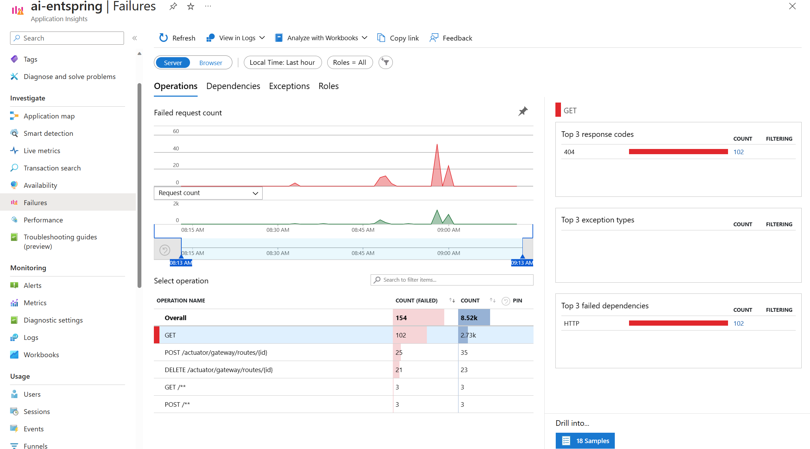
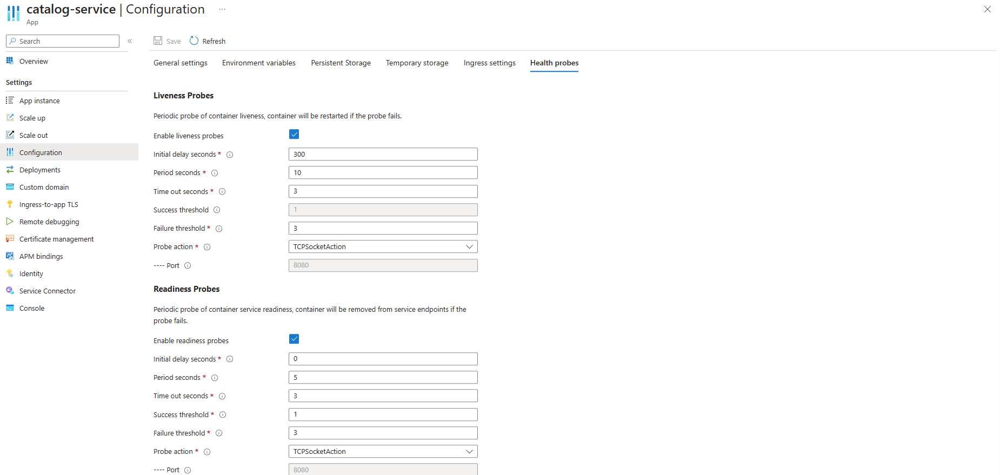
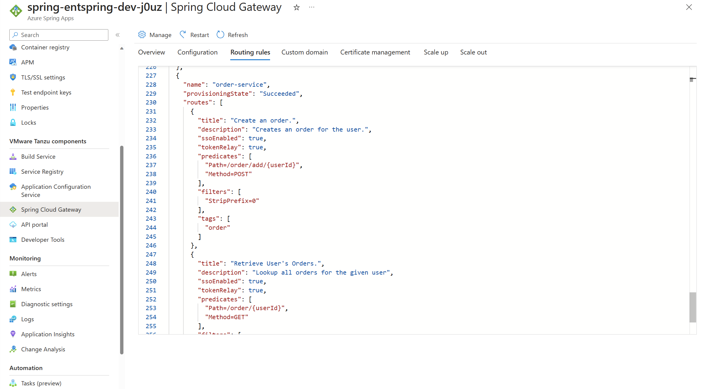
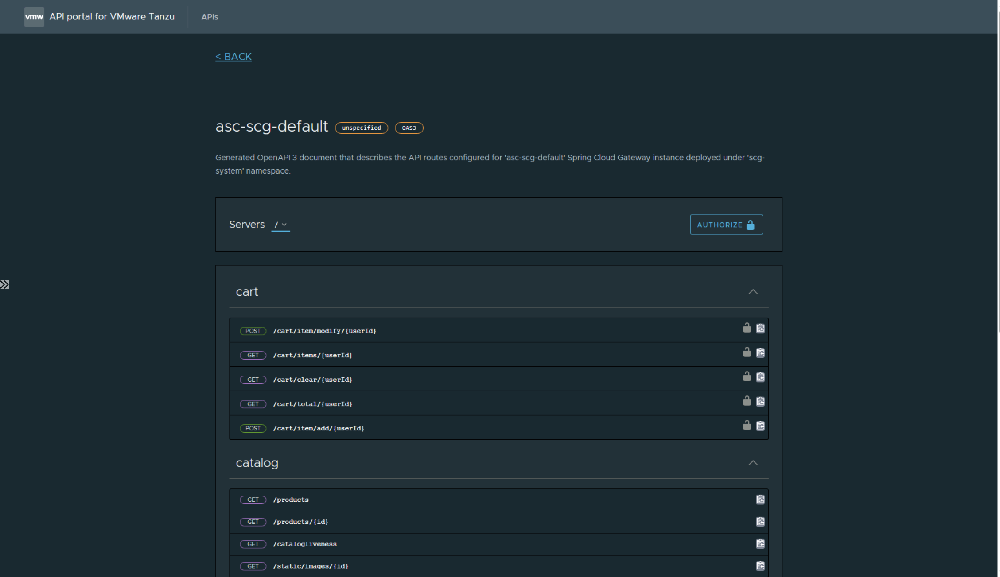

# Monitor operations for the Azure Spring Apps landing zone accelerator

This article provides observability considerations and recommendations for your Spring Boot application that's deployed in Azure Spring Apps.

The organization might provide centralized monitoring that's shared by all workloads or provide dedicated Azure Monitor Log Analytics workspaces per workload. If you take dependency on the centralized resources, ensure that the application team members have access to the logs with their Azure role-based access control (RBAC) roles.

For information about the platform design, see [Workload management and monitoring](/azure/cloud-adoption-framework/ready/landing-zone/design-area/management-workloads).

You can provision your own monitoring resources. This approach gives the application team more autonomy and simplifies the overall management of your application. The tradeoff might be increased management overhead. The Azure Spring Apps landing zone accelerator and the following guidance are based on this approach.

## Design considerations

- **Logs and metrics**. Collect logs and metrics that are emitted from the application and resources. Logs provide insight into the operations of the workload. Metrics are collected at regular intervals and provide near real-time insights. Logs and metrics can help with investigations that are related to the health and utilization of resources.

    Metrics are key for scaling decisions. You can allow apps to scale based on metric thresholds, or apps can scale during a specific time window.

    You should consider storing this data for future analysis. Maintain the ability to visualize data, so you can spot trends quickly.

- **Instrumentation**. Put instrumentation in place to generate more observability data from the application. To collect instrumentation information, use an Application Performance Management (APM) tool, such as Azure Application Insights Java agent. Combine platform diagnostics with this information to provide enhanced monitoring capabilities.

- **Distributed tracing**. Implement distributed tracing to get observability across different services within your Azure Spring Apps ecosystem.

- **Alerts**. The application teams must get notified about events that are important for the workload. You can set alerts that monitor resources based on metrics, such as storage, rate of requests, and data usage.

- **Health probes**. You can set up health probes to detect the health of the backend services. Review how the health probes are set up so that requests are routed to healthy instances and to ensure that the application terminates gracefully if backend services aren't available.

## Design recommendations

- Use Azure Monitor metrics to collect metrics that are emitted from monitored resources into a time-series database.

    For Azure Spring Apps, view the charts in each application overview page and common metrics page.

- Use Log Analytics to collect and view resource and application logs.

  

- Use the diagnostics settings page within Azure Spring Apps to configure the desired combination of diagnostic settings for your apps.

    > [!NOTE]
    > There's a delay for logs to appear in your storage account, your event hub, or Log Analytics. If the Spring app instances are deleted or moved during that time, the diagnostic settings should be deleted to ensure that another app with the same resource ID doesn't reuse the same diagnostic setting.

- Use Application Insights as a consistent Application Performance Monitoring (APM) tool across all application components to collect application logs, metrics, and traces. It can collect data from all the dependencies and traces and has the capability to visualize end-to-end transactions.

    Application Insights' Java in-process agent can be configured to collect additional metrics such as Spring Cloud Resilience4J metrics with micrometer. These metrics can be monitored and visualized from Application Insights.

  Application Map -
  

  Metrics -
  

  Live Metrics - 
  

  Failures -
  

- Implement service discovery using Tanzu Service Registry that allow you to quickly discover and register app instances.

- Use readiness and liveness probes together so that unhealthy app instances are removed from service discovery features.

  

- If your application has a longer startup time, adjust the total timeout `initialDelaySeconds + periodSeconds * failureThreshold` to a value longer than the start time of your application. This adjustment helps avoid the probe failure and forces the application to restart.

- Configure your health probes to take action based on the application-specific command, a TCP Socket connection, or an HTTP request.

- For Spring Boot apps, take advantage of the Spring Boot Actuator Health Indicator to configure your health probes.

- Take advantage of enterprise-grade components such as Spring Cloud Gateway and API Portal to simplify and accelerate API delivery.

  Spring Cloud Gateway -
  

  API Portal -
  

## Next steps

[Azure Spring Apps landing zone accelerator](./landing-zone-accelerator.md)